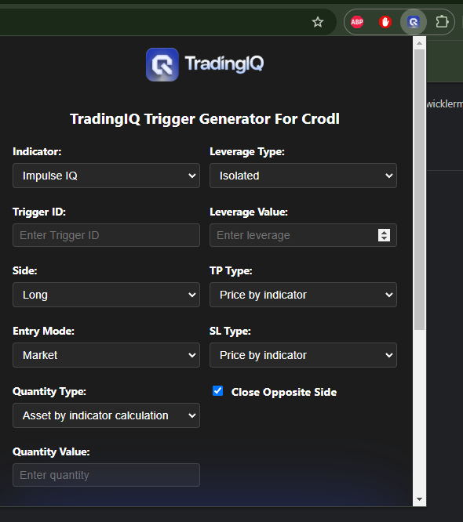
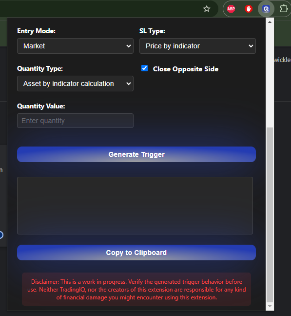

# "TradingIQ Trigger Generator For Crodl" Chrome Extension

A Chrome extension for generating trading triggers for the CrodlTrading platform. This extension provides a convenient way to create and configure trading triggers directly from your browser.

## Features

- Support for multiple indicator types:
  - Impulse IQ
  - Nova IQ (reversion)
  - Nova IQ (trend)
  - Reversal IQ
  - Counter Strike IQ
- Copy to clipboard functionality
- Field validation and error checking
- Configurable trade parameters:
  - Entry modes (Market/Limit)
  - Quantity types (Percentage/Asset/Dollar/Asset by indicator)
  - Leverage types and values
  - Take Profit and Stop Loss settings
  - Opposite close functionality

## Installation

### Development Installation
1. Download the source code:
2. Open Google Chrome and navigate to `chrome://extensions/`
3. Enable "Developer mode" by clicking the toggle switch in the top right corner
4. Click "Load unpacked" and select the extension directory

## Usage

1. Click the extension icon in your Chrome toolbar to open the trigger generator

2. Fill in the required fields:
   - Trigger ID
   - Indicator type
   - Trading side (Long/Short)
   - Entry mode
   - Quantity settings
   - Leverage settings
   - Take Profit and Stop Loss configurations

3. Click "Generate Trigger" to create the trigger JSON

4. Use the "Copy to Clipboard" button to copy the generated trigger

5. Paste the trigger into your CrodlTrading platform

## Configuration Options

### Indicators
- **Impulse IQ**: Standard impulse trading signals
- **Nova IQ (reversion)**: Mean reversion trading strategy
- **Nova IQ (trend)**: Trend following strategy
- **Reversal IQ**: Price reversal signals
- **Counter Strike IQ**: Counter-trend trading signals

### Entry Modes
- **Market**: Immediate execution at market price
- **Limit**: Execution at specified price level
  - Note: Limit orders are not recommended for Binance

### Quantity Types
- **Asset by indicator**: Position size calculated by the indicator
- **Percentage**: Position size as a percentage of available capital
- **Asset**: Direct asset quantity
- **Dollar**: Position size in USD

## Important Notes

- Always verify the generated trigger behavior before use in live trading
- Double-check all parameters and values before submitting triggers
- For detailed documentation on trigger commands, refer to the [Crodl Trading Documentation](https://docs.crodltrading.com/docs/getting-started/override-triggers)

## Development

### Prerequisites
- Google Chrome
- Basic understanding of Chrome extension development
- Familiarity with JavaScript and JSON

### Making Changes
1. Modify the source files as needed
2. Refresh the extension in `chrome://extensions/`
3. Test the changes thoroughly before deployment

### Contributing
1. Fork the repository
2. Create a feature branch
3. Commit your changes
4. Push to the branch
5. Create a Pull Request

## Technical Details

### Storage
The extension uses Chrome's storage API to persist form values between sessions. Form data is automatically saved when changes are made.

### Validation
Input validation is performed on:
- Required fields
- Numeric values
- Conditional requirements based on selected options

## License
See LICENSE file for details

## Support

For issues and feature requests, please create an issue in the repository..

## Disclaimer
This extension is provided as-is. Always verify the generated triggers and test thoroughly before using in live trading. The TradingIQ and developers of this plugin are not responsible for any trading losses or errors that may occur from using this extension.